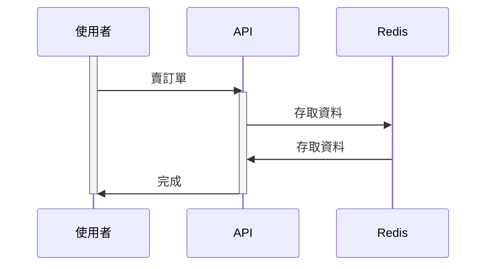

# TradeDemo

# 啟動
啟動 docker
```
make up-test
```

啟動程式
```
go run . server
```

1. 到 swagger http://localhost:1234/docs/index.html#/Order/post_trade_order_test
2. 呼叫多次執行測試
3. 到 redis ui http://localhost:38081/
4. 會看到有 trade:LastOrderID 存在

執行邏輯是如果配對成功就不會生成新的 order id
所以執行後的 order id 如果小於執行測試次數是正常的

# 測試指令
```
make test
```

# 文檔

## 買/賣訂單API

### 架構圖



### 流程圖


