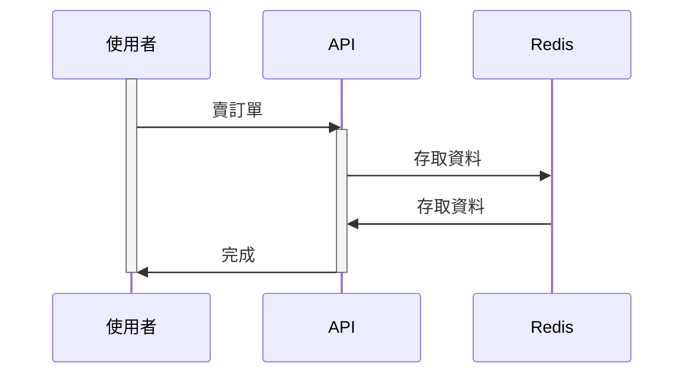
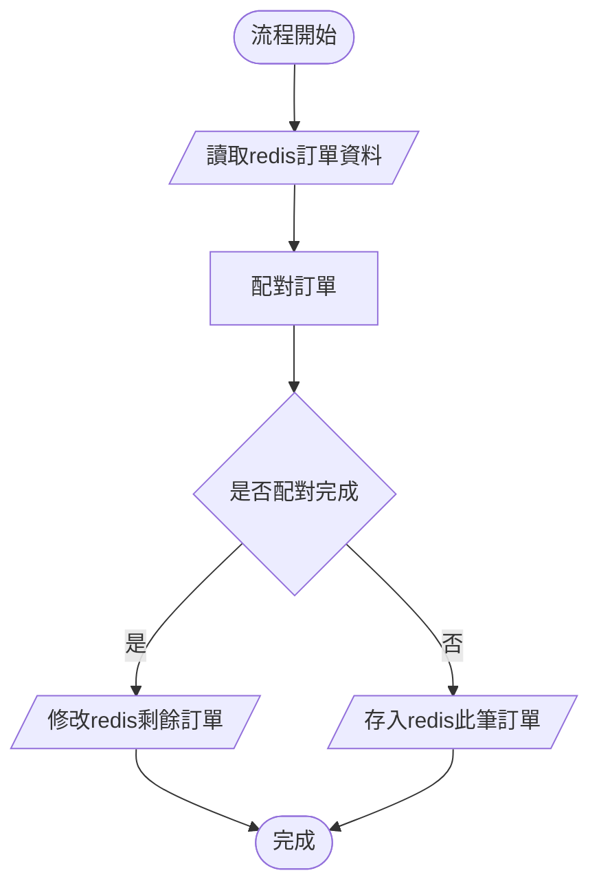

# ZerologixHomework

# Zerologix coding assignment
Imagine you have a trade engine that accepts orders via the protocol (or triggering)
you defined. An order request at least has this information (buy or sell, quantity,
market price or limit price).
The engine matches buy and sell orders that have the same price. Orders have the
same price determined by their timestamp (FIFO). Pending orders queue up in your
system until they are filled or killed. Your system will have multiple traders executing
orders at the same time.

## What is expected?
- SOLID design accommodates requirements to change in the future.
- Testable, compilable and runnable code.
- Concurrent and thread-safe considered.
- Document your design which can be any human-readable form. For example,
README file.
- A git repository can be accessed publicly.
- Golang are preferred but not required.

# 啟動
啟動 docker
```
make up-test
```

啟動程式
```
go run . server
```

swagger api 連結  
http://localhost:1234/docs/index.html#/Order/post_trade_order_buy

redis 連結  
http://localhost:38081/

# 測試指令
```
make test
```

# 文檔

## 買/賣訂單API

### 架構圖



### 流程圖

